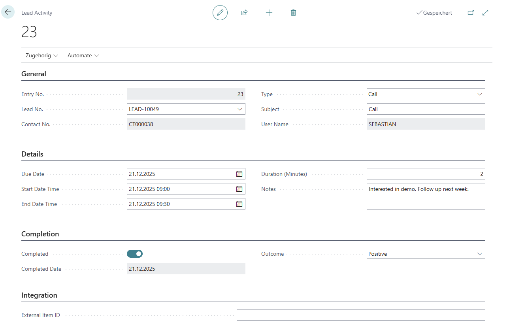
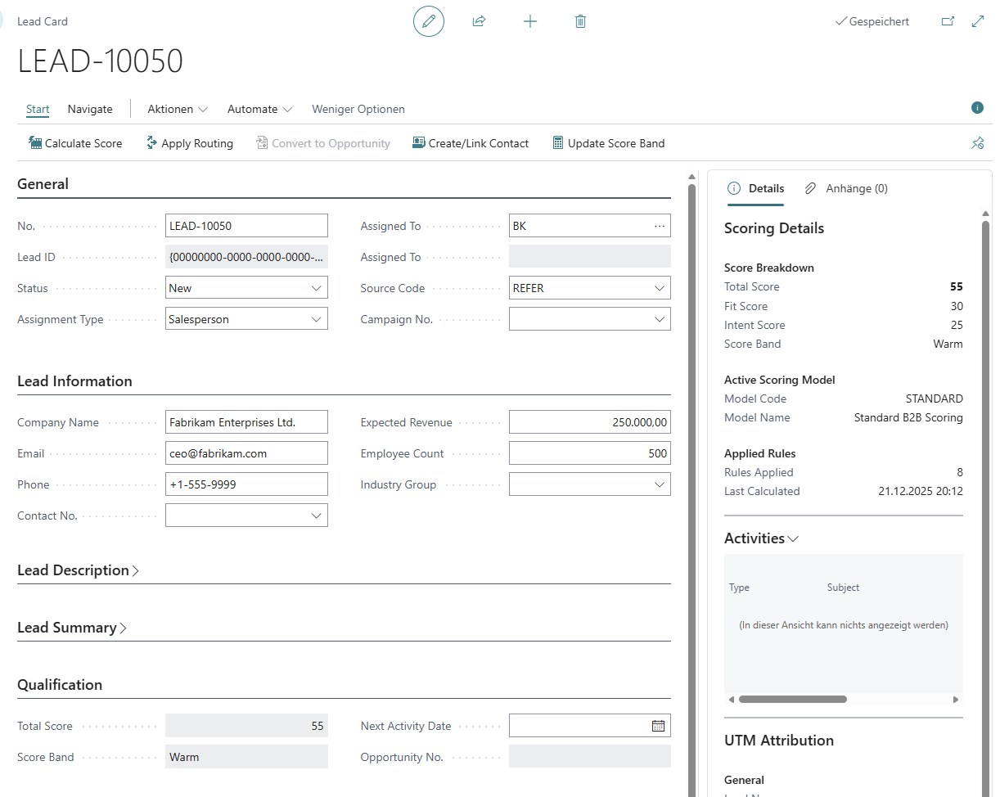
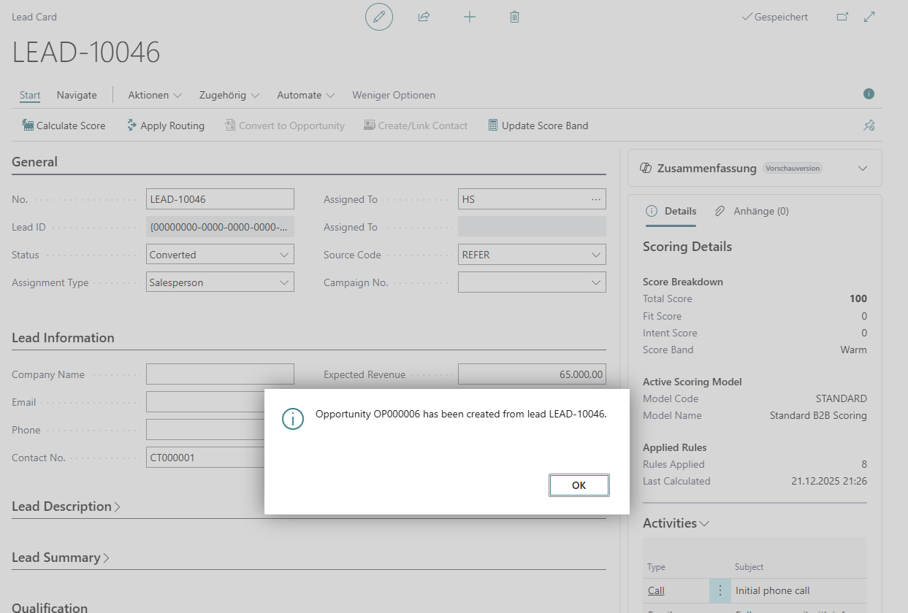

  <h1>📖 Lead Management User Guide</h1>
  
Complete guide for sales teams using the Lead Management extension

---

## Table of Contents

1. [Getting Started](#getting-started)
2. [Creating Leads](#creating-leads)
3. [Working with Leads](#working-with-leads)
4. [Lead Scoring](#lead-scoring)
5. [Lead Assignment](#lead-assignment)
6. [Team Collaboration](#team-collaboration)
7. [Converting to Opportunities](#converting-to-opportunities)
8. [Kanban Pipeline View](#kanban-pipeline-view)
9. [Analytics & Reporting](#analytics--reporting)
10. [Tips & Best Practices](#tips--best-practices)

---

## Getting Started

### Accessing Lead Management

1. Open Business Central
2. Search for **SEW Leads** in the search bar (Alt+Q)
3. Click on **SEW Lead List** to view all leads

### Understanding the Interface

**Lead List Columns:**
- **No.**: Lead number (auto-generated)
- **Company Name**: Prospect's company
- **Contact No.**: Linked BC Contact
- **Source Code**: Where the lead came from
- **Status**: Current stage (New, Contacted, Qualified, etc.)
- **Score**: Calculated priority score
- **Score Band**: Visual priority (Hot 🔥, Warm 🌡️, Cold ❄️)
- **Assigned To**: Salesperson or team owner
- **Expected Revenue**: Potential deal value

**FactBox Panel (Right Side):**
- **Scoring Details**: Shows which rules contributed to the score
- **Contact Information**: Quick view of contact details
- **Activities**: Related tasks and meetings

---

## Creating Leads

### Quick Capture Method (Fastest)

**When to use**: Fast lead entry from phone calls, events, quick notes

**Steps:**
1. Click **+ New** on the Lead List
2. Fill in minimum required fields:
   - **Quick Company Name**: "Contoso Manufacturing Inc."
   - **Quick Email**: "purchasing@contoso.com"
   - **Source Code**: Select from lookup (e.g., WEB, PHONE, EVENT)
3. Optional: Add **Quick Phone** and **Expected Revenue**
4. Save (Ctrl+S or click OK)

**What happens:**
- Lead No. is auto-generated
- Status is set to "New"
- Lead appears in your lead list
- Quick fields are temporary (cleared when Contact is created)

### Full Capture Method (Detailed)

**When to use**: When you have complete information upfront

**Steps:**
1. Click **+ New** on the Lead List
2. Skip Quick fields, go directly to **Contact No.** field
3. Use lookup to find existing Contact OR click **Create Contact** to make a new one
4. Fill in additional details:
   - **Source Code**: Where lead originated
   - **Campaign No.**: If from a marketing campaign
   - **Expected Revenue**: Deal size estimate
   - **Employee Count**: Company size (used in scoring)
   - **Territory Code**: Geographic region
5. Save the lead

**Benefits:**
- Immediate Contact integration
- More data for accurate scoring
- Better deduplication (BC Contact duplicate detection)

---

## Working with Leads

### Status Workflow

Leads progress through defined statuses:

**Status Meanings:**

| Status | When to Use | Next Action |
|--------|-------------|-------------|
| **New** | Just received, not reviewed | Review and categorize |
| **Contacted** | Made first contact | Continue qualification |
| **Nurturing** | Not ready to buy yet | Schedule follow-up |
| **Qualified** | Ready for opportunity | Convert to Opportunity |
| **Converted** | Became an opportunity | Work the opportunity |
| **Disqualified** | Not a fit | Archive, no further action |

### Creating/Linking Contacts

**Required before converting to Opportunity**

**From Quick Capture Lead:**
1. Open the lead
2. Click **Actions → Create/Link Contact**
3. System creates BC Contact from Quick fields
4. Quick fields are cleared
5. Contact No. is populated

**What it does:**
- Creates Contact with Name, Email, Phone
- Links Contact to Lead
- Enables BC duplicate detection
- Allows conversion to Opportunity (requires Contact)

### Adding Communication Notes

Track all interactions in one place:

1. Open lead card
2. Navigate to **Communication** tab
3. Add notes in the text field:
   - "Called 12/21. Interested in demo. Follow up next week."
   - "Emailed pricing. Awaiting response."
4. Save the lead

**Best practices:**
- Date stamp each note
- Include next action
- Note who you spoke with
- Track email/call outcomes

### Engagement Signals

Track how engaged the prospect is:

1. Open lead card
2. Navigate to **Engagement Signals** section
3. Toggle switches for:
   - **Website Visit**: Yes (if they visited your site)
   - **Email Opened**: Yes (if they opened emails)
   - **Attended Event**: Yes (if they came to webinar/trade show)

**Why it matters:**
- Increases lead score automatically
- Identifies hot leads
- Prioritizes your follow-up list

---

## Lead Scoring

### Understanding Scores

**Score Bands:**
- 🔥 **Hot** (70+): Immediate priority, high conversion potential
- 🌡️ **Warm** (40-69): Active follow-up, qualified interest
- ❄️ **Cold** (<40): Nurture campaign, low priority

### Calculating Scores

**Automatic Calculation:**
1. Open any lead
2. Click **Actions → Calculate Score**
3. Score appears in **Score (Total)** field
4. Check **Scoring Details** FactBox to see breakdown

**What gets scored:**
- **Source**: Web leads +10, Referrals +25, Email +15
- **Company Size**: Large companies (>100 employees) +20
- **Engagement**: Website visit +8, Email open +5
- **Other**: Custom rules defined by admin

**Recalculating:**
- Scores update when lead data changes
- Use **Actions → Calculate Score** to refresh
- Bulk action available: Select multiple leads → **Recalculate Scores**

### Manual Override

**When to use**: Strategic accounts, CEO referrals, urgent follow-ups

**Steps:**
1. Open lead
2. Manually change **Score (Total)** field to desired value (e.g., 100)
3. Score band updates automatically
4. To revert: Click **Actions → Calculate Score**

**Important:** Manual scores are overwritten when "Calculate Score" is used again.

---

## Lead Assignment

### Viewing Your Leads

**Personal Filter:**
1. Open **SEW Leads** list
2. Click **Filter Pane** (right side)
3. Filter **Assignment Type** = "Salesperson"
4. Filter **Salesperson Code** = your code
5. Result: Shows only leads assigned directly to you

**Team Filter:**
1. Filter **Assignment Type** = "Team"
2. Filter **Assigned To Code** = your team code
3. Result: Shows all leads assigned to any team you're in

### Automatic Routing

**How it works:**
1. Admin creates routing rules (e.g., Score ≥ 75 → ENTERPRISE Team)
2. You create or update a lead
3. Click **Actions → Apply Routing**
4. System assigns lead based on matching rules

**What gets routed:**
- High-score leads → Enterprise team
- Web leads → Inbound response team
- Territory-based → Regional salesperson
- Default → Round robin rotation

### Manual Reassignment

**When to use**: Workload balancing, expertise requirements, geographic changes

**Steps:**
1. Open lead
2. Click **Actions → Reassign Lead**
3. Dialog appears:
   - Change **Assignment Type**: Salesperson or Team
   - Select **Assigned To**: Pick from lookup
   - Add **Reason**: "Lead requires enterprise expertise"
4. Click **OK**

**Audit Trail:**
- Every reassignment is logged
- View **Related → Assignment History**
- Shows From/To, Reason, Timestamp, Changed By

---

## Team Collaboration

### Working Team-Assigned Leads

**Scenario**: Your team (INBOUND) has 20 leads. How do you collaborate?

**Viewing Team Leads:**
1. Open **SEW Leads**
2. Filter **Assignment Type** = "Team"
3. Filter **Assigned To Code** = INBOUND
4. Result: All team members see the same leads

**Best Practices:**
- Add communication notes so teammates see progress
- Avoid duplicating contact efforts (check notes first)
- Update Status regularly (New → Contacted → Qualified)
- Convert to Opportunity when ready (picks owner)

### Team Structure

**Understanding Teams:**
- Teams are standard BC objects (search "Teams")
- Teams have multiple salesperson members
- Leads assigned to team = shared ownership
- Opportunities require individual owner (team member picks ownership)

**Example Teams:**
- **INBOUND**: Fast response to web/email leads
- **ENTERPRISE**: High-value leads requiring consultative selling
- **VERTICAL-MFG**: Manufacturing industry specialists

---

## Converting to Opportunities

### Prerequisites

Before converting, ensure:
- ✅ Lead **Status** = "Qualified"
- ✅ **Contact No.** is populated (use Create/Link Contact if blank)
- ✅ Lead has been worked (not just created)

### Individual Lead Conversion

**When**: Lead assigned to you (not a team)

**Steps:**
1. Open qualified lead
2. Click **Actions → Convert to Opportunity**
3. Dialog shows:
   - **Salesperson**: Auto-filled with your code
   - **Opportunity Description**: Auto-filled from lead name
   - **Create Contact**: Already done (shows existing Contact No.)
4. Click **OK**

**Result:**
- New BC Opportunity created
- Lead Status → "Converted"
- Lead linked to Opportunity (Related → Opportunity)
- Work continues in standard BC Opportunity Card

### Team Lead Conversion

**When**: Lead assigned to a team (e.g., ENTERPRISE)

**Steps:**
1. Open qualified team lead
2. Click **Actions → Convert to Opportunity**
3. Dialog shows **Salesperson Selection**:
   - If you're in the team: Auto-selects you
   - If not in team: Shows all team members
   - Pick the team member who will own the opportunity
4. Click **OK**

**Why it matters:**
- BC Opportunities require individual owner (not teams)
- This is the handoff from collaboration → individual accountability
- Selected salesperson owns opportunity in sales pipeline

---

## Kanban Pipeline View

### Accessing Kanban Board

1. Search for **SEW Lead Kanban** in Business Central
2. Board shows leads grouped by stages
3. Color-coded by score band (Red=Hot, Orange=Warm, Gray=Cold)

### Using the Board

**Drag-and-Drop:**
1. Click and hold a lead card
2. Drag to different stage column
3. Release to drop
4. System updates:
   - **Stage Code** field
   - **Probability %** (from stage default)

**Filtering:**
- **Owner**: See only your leads or team leads
- **Score Band**: Show only Hot leads
- **Source Code**: Filter by lead source

**Actions:**
- **Refresh**: Reload board data
- **Clear Filters**: Show all leads
- **Manage Stages**: Configure pipeline stages
- **Lead List**: Return to list view

**Tips:**
- Use for weekly pipeline review meetings
- Identify bottlenecks (stages with too many leads)
- Prioritize hot leads in early stages
- Move stale leads to Disqualified

---

## Analytics & Reporting

### Personal Performance

**View Your Metrics:**
1. Search for **SEW User Performance** query
2. Filter to your Salesperson Code
3. See:
   - Total leads assigned
   - Pipeline value (sum of Expected Revenue)
   - Average score of your leads
   - Activity count (tasks, meetings)
   - Conversion metrics (converted leads, opportunity value)

### Team Performance

**Compare Sources:**
1. Search for **SEW Source Performance** query
2. See which sources generate best leads:
   - Lead count by source
   - Conversion rate
   - Average score
   - Opportunity value

**Use cases:**
- Focus on high-performing sources
- Deprioritize low-quality sources
- Justify marketing spend

### Pipeline Analysis

**Funnel View:**
1. Search for **SEW Lead Funnel Analysis** query
2. See stage-by-stage metrics:
   - Lead count per stage
   - Average days in stage
   - Pipeline value per stage

**Identify Issues:**
- Bottleneck stages (high day count)
- Drop-off stages (low conversion)
- Stale leads (>30 days in stage)

### Dashboard

**Real-Time Overview:**
1. Search for **SEW Lead Analytics**
2. View metrics:
   - Total Active Leads
   - Pipeline Value
   - Hot Leads Count
   - Conversion Rate %
   - Open/Overdue Activities
3. Click any metric to drill down to lead list

**Role Center Integration:**
- Add **SEW Lead Analytics RC** to your Role Center
- Cue tiles for quick access
- RefreshOnActivate = real-time data

---

## Tips & Best Practices

### Daily Workflow

**Morning Routine:**
1. Open SEW Leads filtered to your assignments
2. Sort by **Score** (descending) - hot leads first
3. Check **Overdue Activities** in analytics
4. Work through top 5 hottest leads

**Throughout Day:**
- Update Status as you contact leads
- Add communication notes after each interaction
- Toggle engagement signals when prospects respond
- Convert qualified leads immediately

**End of Day:**
- Schedule follow-ups as BC Activities
- Update Expected Revenue for progressing leads
- Reassign leads if needed (vacation, expertise)

### Lead Qualification

**BANT Framework:**
- **Budget**: Do they have budget? (ask, note in comments)
- **Authority**: Are they decision-maker? (if not, who is?)
- **Need**: Do they have a clear problem we solve?
- **Timeline**: When are they looking to buy?

**When to Qualify:**
- All BANT criteria met
- Engaged in conversation (not just form fill)
- Expressed interest in demo/proposal
- Contact created and verified

**When to Disqualify:**
- No budget or authority
- Outside your target market
- No response after 3+ attempts
- Competitor/not a fit

### Score Optimization

**Boost Scores:**
- Add Employee Count (large companies score higher)
- Toggle engagement signals (website visit, email open)
- Update Expected Revenue (higher value = higher priority)
- Change Source (referrals score highest)

**When to Override:**
- Strategic account (CEO referral)
- Event-driven urgency (trade show VIP)
- Executive directive
- Timing-sensitive opportunity

### Team Collaboration

**Communication:**
- Always add notes after contacting team leads
- Check notes before contacting (avoid duplicate calls)
- Update Status so team knows progress
- Convert promptly when qualified (frees team capacity)

**Workload:**
- Use round robin for fair distribution
- Monitor team lead counts (balance workload)
- Reassign if someone overwhelmed
- Pick up unworked team leads proactively

### Pipeline Management

**Weekly Review:**
1. Open Kanban board
2. Identify leads stuck in stage >14 days
3. Take action:
   - Move forward if progressing
   - Move to Nurturing if not ready
   - Disqualify if no response
4. Focus on Hot leads in early stages (quick wins)

**Monthly Cleanup:**
- Review all "New" status leads >30 days old
- Contact or disqualify (prevent pipeline rot)
- Archive converted leads (Status already "Converted")
- Celebrate wins (converted leads → closed opportunities)

---

## Troubleshooting

### Can't Convert to Opportunity

**Problem**: "Convert to Opportunity" action grayed out or errors

**Solutions:**
1. Check **Status** = "Qualified" (not New, Contacted, or other)
2. Ensure **Contact No.** is populated
   - If blank: Click **Actions → Create/Link Contact**
3. Verify you have permission to create Opportunities
4. Check lead isn't already converted (Status = "Converted")

### Score Not Calculating

**Problem**: Score shows 0 or doesn't update

**Solutions:**
1. Admin: Ensure at least one Scoring Model is **Active**
2. Admin: Check Scoring Rules have point values >0
3. Fill in scorable fields:
   - Source Code (required)
   - Employee Count (if using company size rules)
   - Engagement signals (if using engagement rules)
4. Click **Actions → Calculate Score**

### Routing Not Assigning

**Problem**: "Apply Routing" does nothing

**Solutions:**
1. Admin: Check at least one Routing Rule exists with **Active** = true
2. Verify lead matches rule conditions:
   - Score meets threshold (if score-based rule)
   - Source Code matches (if source-based rule)
   - Territory matches (if territory-based rule)
3. Check Team/Salesperson Code in rule is valid and active
4. Verify you have permissions to modify assignment fields

### Can't See Team Leads

**Problem**: Teammate says team lead exists, but you don't see it

**Solutions:**
1. Verify you're a member of the team (search "Teams", check members)
2. Apply correct filter:
   - **Assignment Type** = "Team"
   - **Assigned To Code** = [your team code]
3. Check Status filter (Converted leads hidden by default)
4. Refresh list (F5)

---

## Getting Help

  <h4>📞 Support Resources</h4>
  <ul>
    <li><strong>Admin Questions</strong>: Contact your system administrator for setup issues</li>
    <li><strong>Training</strong>: Request additional training session if needed</li>
    <li><strong>Technical Issues</strong>: <a href="https://github.com/walter75-Consulting/Business-Central-Apps/issues">GitHub Issues</a></li>
    <li><strong>Documentation</strong>: <a href="lead-management.html">Technical Documentation</a></li>
  </ul>

---

  
<strong>Last Updated:</strong> December 21, 2024

  
<strong>Version:</strong> 1.0.0

  
<a href="lead-management.html">← Back to Technical Documentation</a>

