<div class="hero-section">
  <h1>🎯 walter75 - Lead Management</h1>
  <p class="hero-tagline">Complete CRM lead management with AI-powered scoring, automated routing, and team collaboration</p>
  <div class="badge-container">
    <span class="badge">CRM</span>
    <span class="badge">Lead Scoring</span>
    <span class="badge">Automation</span>
    <span class="badge">Analytics</span>
    <span class="badge">Kanban</span>
  </div>
</div>

---

## 📋 Overview

A complete lead management system for Microsoft Dynamics 365 Business Central that enables SMBs to capture, score, route, and convert leads without external CRM systems. Features AI-powered scoring with multiple models, intelligent routing engine, team-based collaboration, interactive Kanban boards, and comprehensive analytics.

<div class="feature-grid">
  <div class="feature-card">
    <h3>🤖 AI-Powered Scoring</h3>
    <p>Multiple configurable scoring models with rule-based intelligence</p>
  </div>
  <div class="feature-card">
    <h3>🎯 Automated Routing</h3>
    <p>Priority-based assignment to teams or individuals with round-robin support</p>
  </div>
  <div class="feature-card">
    <h3>👥 Team Collaboration</h3>
    <p>Shared lead ownership with seamless handoff to opportunities</p>
  </div>
  <div class="feature-card">
    <h3>📊 Kanban Pipeline</h3>
    <p>Visual drag-and-drop board for pipeline management</p>
  </div>
  <div class="feature-card">
    <h3>📈 Analytics Dashboard</h3>
    <p>Real-time metrics, conversion tracking, and performance reporting</p>
  </div>
  <div class="feature-card">
    <h3>🔗 BC Integration</h3>
    <p>Native integration with Contacts, Opportunities, and Sales processes</p>
  </div>
</div>

## 🔢 Technical Details

<div class="info-box info-box-primary">
  <p><strong>Object ID Range:</strong> 91700-91799</p>
  <p><strong>Dependencies:</strong> walter75 - BaseApp Basic</p>
  <p><strong>Target Platform:</strong> Business Central Cloud 27.0+</p>
  <p><strong>Development Time:</strong> 3-4 weeks (Dec 2024)</p>
</div>

## 🌟 Key Features

### Lead Capture & Management

**Quick Capture Mode**
- Fast lead entry with minimal fields (Company, Email, Phone)
- Source code tracking for attribution
- GDPR-compliant consent management
- Auto-create BC Contacts on engagement

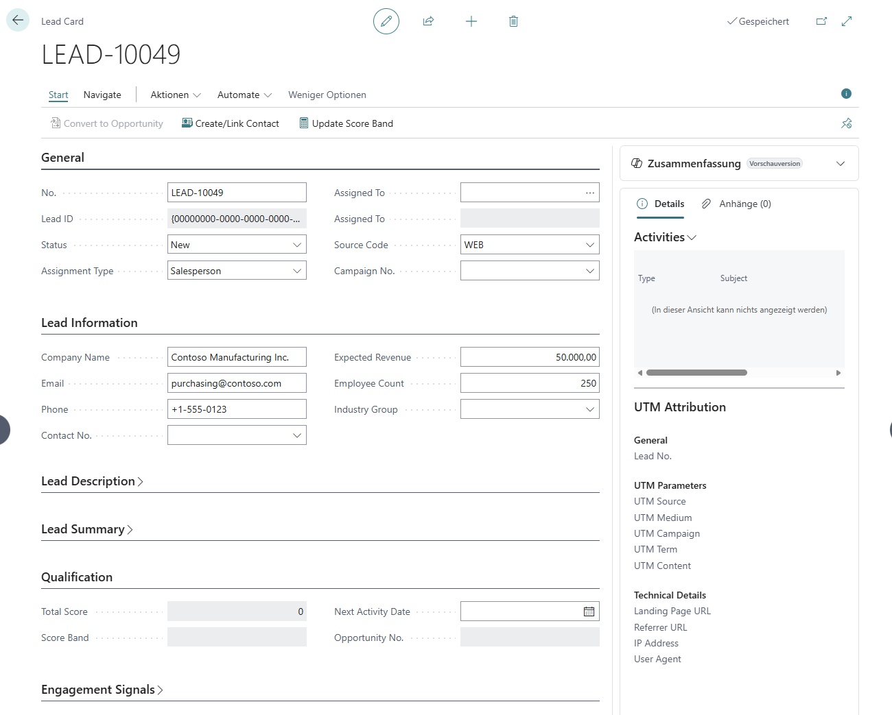
*Lead Card with company details and engagement signals*

**Status Workflow**
- **New**: Just received, not yet reviewed
- **Contacted**: Sales rep made first contact
- **Qualified**: Meets criteria, ready for opportunity
- **Converted**: Successfully converted to opportunity
- **Disqualified**: Not a fit, archived

### Multi-Model Lead Scoring

Configure multiple scoring strategies and switch between them without changing lead data.

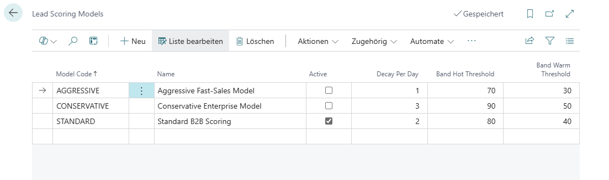
*Three pre-configured scoring models: Standard, Aggressive, Conservative*

**Scoring Rules**
- Source-based scoring (web, email, referral, phone)
- Company size weighting (employee count, revenue)
- Engagement signals (website visits, email opens)
- Custom rule creation with point values
- Real-time score calculation

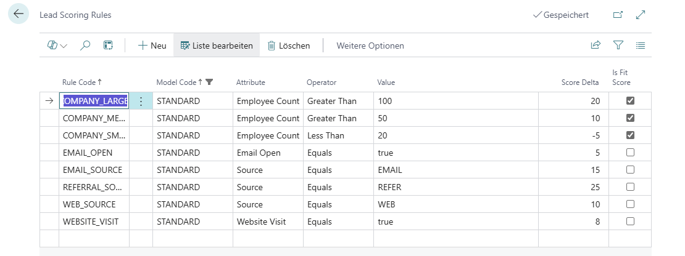
*Configurable scoring rules with point values*

**Score Bands**
- 🔥 **Hot**: Score ≥ 70 (immediate priority)
- 🌡️ **Warm**: Score 40-69 (active follow-up)
- ❄️ **Cold**: Score < 40 (nurture campaign)

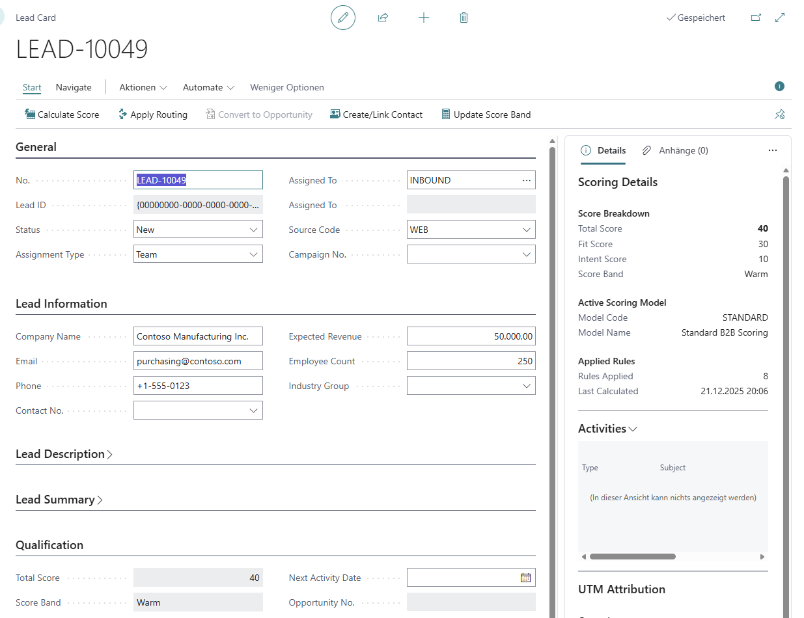
*Scoring Details FactBox showing applied rules*

### Intelligent Routing Engine

**Priority-Based Routing**
- Rules execute in priority order
- First matching rule wins
- Mix team and individual assignments

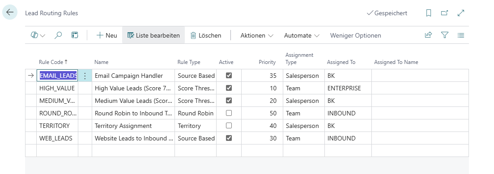
*Routing rules with priority hierarchy*

**Rule Types**
- **Score Threshold**: Route based on lead score
- **Source-Based**: Route by lead source code
- **Territory**: Geographic assignment
- **Round Robin**: Fair distribution across salespersons

**Assignment Strategies**
- Assign to teams for collaborative selling
- Assign to individuals for direct ownership
- Automatic rotation with round-robin
- Manual override with full audit trail

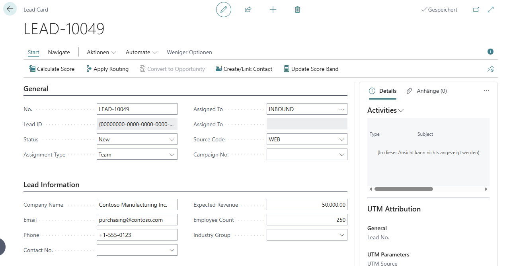
*Automated routing assigns leads to teams or salespersons*

### Team Collaboration

**Team-Based Assignments**
- Shared lead ownership among team members
- All team members can see and work team leads
- Perfect for pod-based or inbound response teams

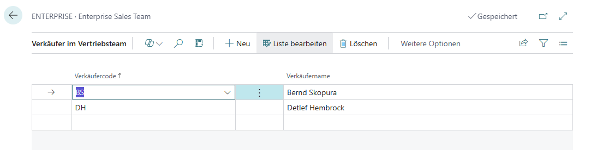
*Team structure with member assignments*

**Team to Individual Handoff**
- Convert qualified leads to opportunities
- System prompts to select team member for ownership
- Seamless transition from collaboration to individual accountability

### Interactive Kanban Board

**Visual Pipeline Management**
- Drag-and-drop leads between stages
- Color-coded by score band (Hot/Warm/Cold)
- Real-time stage counts
- Filter by owner, score band, or source

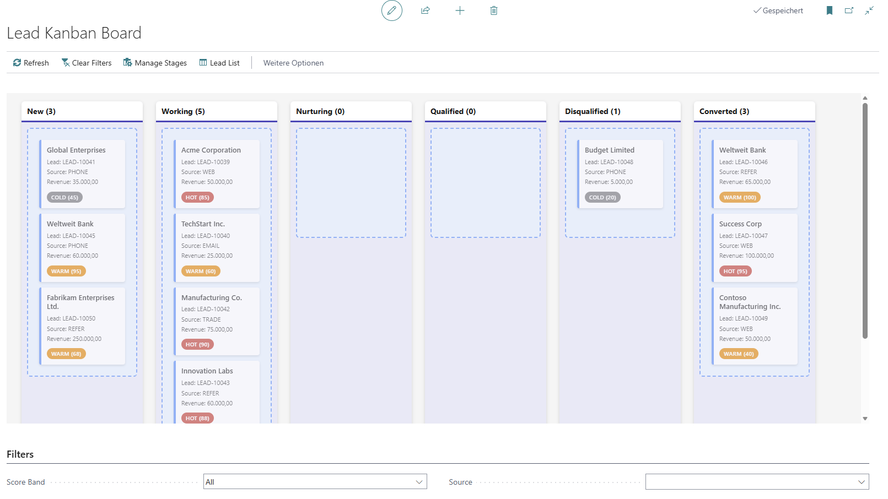
*Kanban board with lead stages and drag-and-drop*

**Stage Management**
- Custom pipeline stages with sequence control
- Default probability % per stage
- Automatic probability update on stage change
- Excludes Converted/Disqualified leads

### Analytics & Reporting

**Real-Time Dashboard**
- Total active leads and pipeline value
- Hot leads count with drill-down
- Conversion rate tracking (30-day)
- Activity metrics (open/overdue)
- Average score calculation

**Performance Queries**
- **Lead Funnel Analysis**: Stage-based conversion rates
- **Source Performance**: Lead source effectiveness metrics
- **User Performance**: Salesperson activity and conversion tracking
- **Campaign ROI**: UTM-based marketing attribution

**Export & Integration**
- Export to Excel/Power BI via queries
- OData/REST API endpoints
- Power Automate integration
- Custom report development

### Audit Trail & Compliance

**Assignment Log**
- Full history of all lead reassignments
- Tracks From/To assignment changes
- Reason tracking (automatic vs manual)
- Timestamp and user tracking

**System Audit Fields**
- SystemCreatedBy / SystemCreatedAt
- SystemModifiedBy / SystemModifiedAt
- FlowFields for username display

**GDPR Compliance**
- Marketing consent tracking
- Data classification on all fields
- Consent source and timestamp
- Right to be forgotten support

## 📦 Installation

<div class="step-container">
  <div class="step">
    <div class="step-number">1</div>
    <div class="step-content">
      <h4>Install Dependencies</h4>
      <p>First install <strong>walter75 - BaseApp Basic</strong></p>
    </div>
  </div>
  
  <div class="step">
    <div class="step-number">2</div>
    <div class="step-content">
      <h4>Download Extension</h4>
      <p>Download the latest <code>.app</code> file from <a href="https://github.com/walter75-Consulting/Business-Central-Apps/releases">Releases</a></p>
    </div>
  </div>
  
  <div class="step">
    <div class="step-number">3</div>
    <div class="step-content">
      <h4>Install in Business Central</h4>
      <p>Install via <strong>Extension Management</strong> in Business Central</p>
    </div>
  </div>
  
  <div class="step">
    <div class="step-number">4</div>
    <div class="step-content">
      <h4>Create Demo Data</h4>
      <p>Run <strong>SEW Demo Data Management</strong> to create sample leads, models, and rules</p>
    </div>
  </div>
</div>

## 🔧 Configuration

### Lead Setup

1. Search for **SEW Lead Setup** in Business Central
2. Configure:
   - **Lead No. Series**: Auto-numbering pattern
   - **Default Owner**: Optional default salesperson
   - **Auto Create Contact On Working**: Recommended: Yes
   - **Enable Quick Capture**: Recommended: Yes
   - **SLA First Response**: Hours for response target

### Lead Sources

1. Search for **SEW Lead Sources**
2. Create sources for attribution tracking:
   - WEB-CONTACT (Website contact form)
   - EVENT-TRADESHOW (Trade show leads)
   - REFERRAL (Customer referrals)
   - EMAIL (Direct email inquiries)

### Lead Stages

1. Search for **SEW Lead Stages**
2. Configure your pipeline stages:
   - Set **Sequence** for display order
   - Set **Probability %** for forecasting
   - **Final Stage**: Marks stage as won/lost

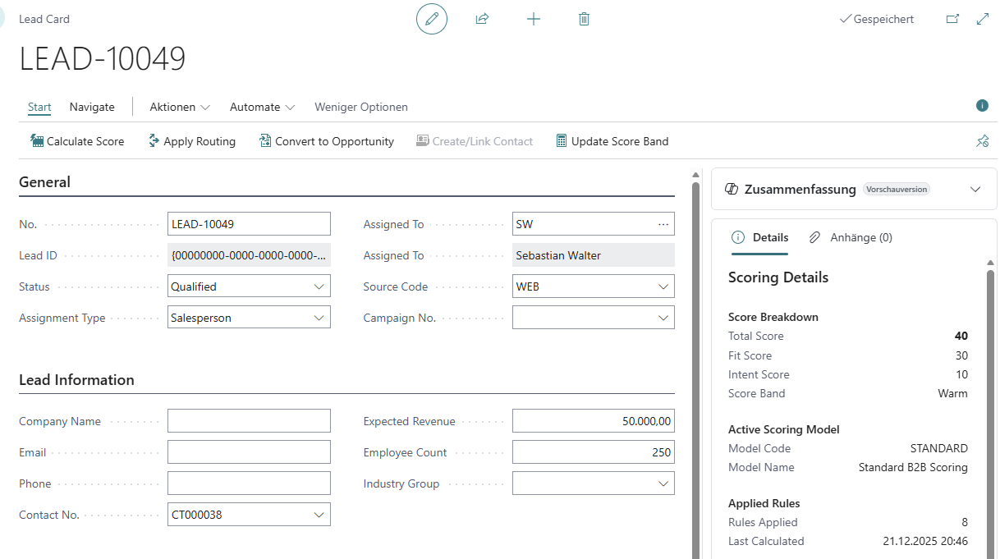
*Lead status progression in dropdown*

### Scoring Models

1. Search for **SEW Lead Scoring Models**
2. Create or modify models:
   - **STANDARD**: Balanced approach
   - **AGGRESSIVE**: High velocity sales
   - **CONSERVATIVE**: Selective qualification
3. Click **Navigate → Scoring Rules** to define point values
4. Set one model as **Active**

### Routing Rules

1. Search for **SEW Lead Routing Rules**
2. Create rules with priority order:
   - Lower priority number = higher precedence
   - Set **Rule Type**, **Condition**, **Assignment Type**
   - Choose **Team Code** or **Salesperson Code**
3. Test with sample leads


*Lead List view with filters and actions*

## 💡 Usage Examples

### Example 1: Capture Web Lead

```
1. Open SEW Leads → Click + New
2. Enter:
   - Quick Company Name: "Contoso Manufacturing"
   - Quick Email: "purchasing@contoso.com"
   - Source Code: WEB
   - Status: New
3. Click Actions → Calculate Score
4. Click Actions → Apply Routing
5. Lead auto-assigned to INBOUND team
```


*Creating a new lead with quick capture*

### Example 2: Qualify and Convert

```
1. Open lead → Click Actions → Create/Link Contact
2. Change Status to "Qualified"
3. Click Actions → Convert to Opportunity
4. System creates BC Opportunity with Contact link
5. Lead Status → "Converted"
```

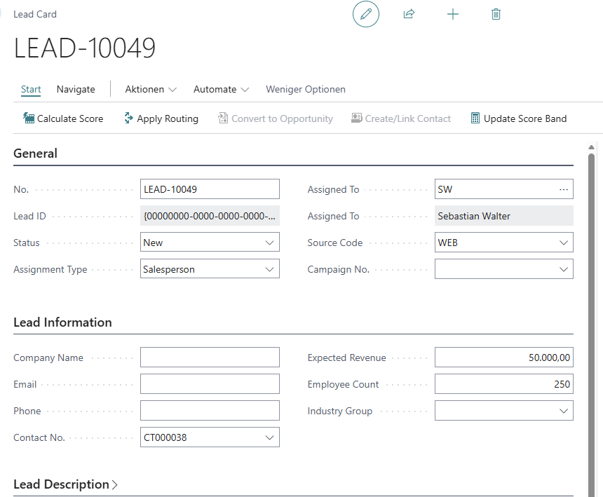
*Lead with Contact created and ready for conversion*

### Example 3: Team Collaboration

```
1. Create routing rule: Score ≥ 75 → ENTERPRISE Team
2. Create high-score lead (referral + large company)
3. Click Actions → Apply Routing
4. Lead assigned to ENTERPRISE Team
5. All team members see lead in filtered view
6. Convert to opportunity → Select team member for ownership
```


*Team structure for collaborative lead management*

### Example 4: Pipeline Management

```
1. Open SEW Lead Kanban board
2. View leads grouped by stage
3. Drag lead from "Contacted" to "Qualified"
4. System updates Stage Code and Probability %
5. Filter by score band to prioritize hot leads
```

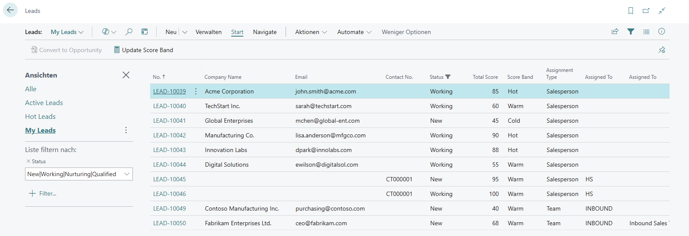
*Filtering leads by assignment and status*

## 🔗 Integration Points

### Contact Integration

- Auto-create BC Contacts from leads
- Link to existing Contacts via email match
- Sync contact updates back to leads
- Leverage BC's duplicate management


*Contact created from lead with populated fields*

### Opportunity Integration

- One-click conversion to BC Opportunities
- Transfer salesperson, contact, and value
- Link opportunity back to lead
- Track conversion in Assignment Log

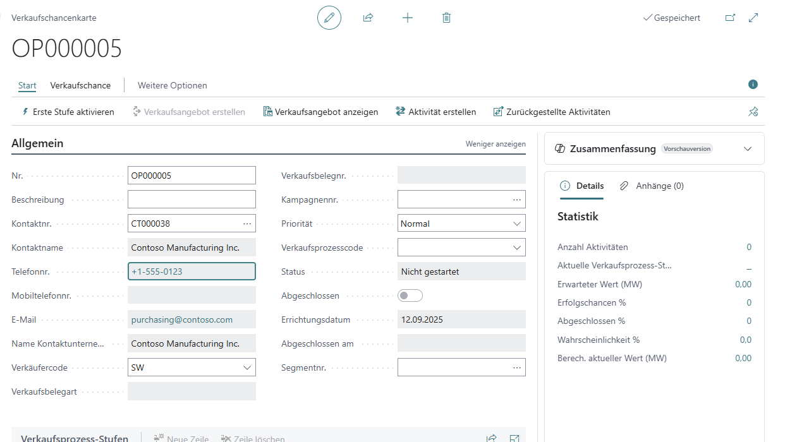
*Converted opportunity with data from lead*

### Campaign Integration

- Link leads to BC Campaigns
- Track campaign effectiveness via Source Performance query
- UTM parameter tracking for digital campaigns
- Campaign ROI analysis

### Activity Integration

- Create BC Activities linked to leads
- Track calls, meetings, tasks
- Activity metrics in User Performance query
- Overdue activity alerts

### API Integration

**Available Endpoints**
- `GET /api/v2.0/companies({id})/sewLeads`
- `POST /api/v2.0/companies({id})/sewLeads`
- `PATCH /api/v2.0/companies({id})/sewLeads({leadId})`
- `DELETE /api/v2.0/companies({id})/sewLeads({leadId})`

**Integration Scenarios**
- Marketing automation platforms → create leads
- Web forms → POST lead data
- Chatbots → capture and score in real-time
- Power Automate → trigger actions on high-score leads

## 📊 Analytics & Reporting

### Built-In Queries

**Lead Funnel Analysis (Query 91761)**
- Lead count and pipeline value per stage
- Average days in stage calculation
- Conversion rate tracking
- Export to Power BI, Excel

**Source Performance (Query 91762)**
- Total leads and value by source
- Conversion tracking: converted leads, opportunity value
- Hot leads count by source
- Source Type grouping

**User Performance (Query 91763)**
- Lead volume and pipeline value by salesperson
- Activity metrics: total, completed
- Conversion metrics: leads, value, avg time
- Filter by status, date, score band

**Campaign ROI (Query 91764)**
- UTM-based tracking (Campaign, Source, Medium)
- Lead generation metrics
- Conversion rate and opportunity value
- Marketing effectiveness analysis

### Analytics Dashboard

Search for **SEW Lead Analytics** to access:
- Pipeline overview (active leads, value, hot leads, avg score)
- Conversion metrics (rate %, 30-day conversions, opportunity value)
- Activity metrics (open activities, overdue)
- DrillDown navigation to filtered lists
- Color-coded indicators (Favorable/Attention/Unfavorable)

### Role Center Component

Add **SEW Lead Analytics RC** to your Role Center:
- Cue tiles: Active Leads, Hot Leads, New Leads (7d)
- Open/Overdue Activities
- Converted (30d), Conversion Rate
- DrillDown to filtered lists for each cue
- RefreshOnActivate for real-time updates

## 🎓 Best Practices

### Scoring Strategy

1. **Start Simple**: Use STANDARD model initially
2. **Test & Iterate**: Create demo leads, analyze results
3. **A/B Test**: Switch models, compare lead rankings
4. **Custom Rules**: Add industry-specific scoring (e.g., company size thresholds)
5. **Regular Review**: Adjust points based on actual conversion data

### Routing Configuration

1. **Priority Order**: Highest priority = most specific rules
2. **Catch-All**: Use Round Robin as lowest priority (default)
3. **Team Balance**: Assign high-score leads to enterprise teams
4. **Territory**: Geographic routing for localized sales
5. **Load Balance**: Round robin prevents lead hoarding

### Team Structure

1. **Inbound Team**: Fast response to web/email leads
2. **Enterprise Team**: High-score leads requiring consultative selling
3. **Vertical Teams**: Industry-specific teams (manufacturing, retail)
4. **Team Size**: 3-5 members per team for optimal collaboration
5. **Clear Ownership**: Define when leads transition from team → individual

### Pipeline Management

1. **Stage Definition**: Keep stages simple (4-6 stages typical)
2. **Probability Alignment**: Set realistic % per stage
3. **Stage Time Limits**: Use Avg Days in Stage to identify bottlenecks
4. **Regular Cleanup**: Move stale leads to Nurture or Disqualified
5. **Kanban Usage**: Weekly pipeline review meetings using Kanban board

## 🔍 Troubleshooting

<div class="info-box info-box-warning">
  <h4>⚠️ Common Issues</h4>
  
  <p><strong>Scoring not calculating:</strong></p>
  <ul>
    <li>Ensure at least one Scoring Model is set to <strong>Active</strong></li>
    <li>Check Scoring Rules have point values > 0</li>
    <li>Verify lead fields match rule conditions</li>
  </ul>
  
  <p><strong>Routing not assigning:</strong></p>
  <ul>
    <li>Check at least one Routing Rule exists with <strong>Active</strong> = true</li>
    <li>Verify rule conditions match lead attributes</li>
    <li>Ensure Team/Salesperson Code is valid and active</li>
  </ul>
  
  <p><strong>Opportunity conversion fails:</strong></p>
  <ul>
    <li>Lead Status must be "Qualified"</li>
    <li>Lead must have Contact No. populated (click Create/Link Contact first)</li>
    <li>User must have permissions to create Opportunities</li>
  </ul>
  
  <p><strong>Assignment Log empty:</strong></p>
  <ul>
    <li>Use "Apply Routing" action to trigger routing and logging</li>
    <li>Manual assignment changes require saving the record</li>
    <li>Check permissions on SEW Lead Assignment Log table</li>
  </ul>
</div>

## 📚 Additional Resources

<div class="doc-links">
  <a href="lead-management-user-guide.html" class="doc-link">
    <span class="doc-icon">📖</span>
    <div>
      <strong>User Guide</strong>
      <p>Step-by-step instructions for end users</p>
    </div>
  </a>
  <a href="https://github.com/walter75-Consulting/Business-Central-Apps/releases" class="doc-link">
    <span class="doc-icon">📦</span>
    <div>
      <strong>Download</strong>
      <p>Get the latest release</p>
    </div>
  </a>
  <a href="https://github.com/walter75-Consulting/Business-Central-Apps/issues" class="doc-link">
    <span class="doc-icon">🐛</span>
    <div>
      <strong>Report Issues</strong>
      <p>Submit bugs or feature requests</p>
    </div>
  </a>
</div>

## 🚀 Roadmap

### Phase 1: MVP ✅ (Completed Dec 2024)
- ✅ Lead capture with quick fields
- ✅ Multi-model scoring engine
- ✅ Priority-based routing
- ✅ Team collaboration
- ✅ Opportunity conversion
- ✅ Assignment audit trail

### Phase 2: Advanced ✅ (Completed Dec 2024)
- ✅ Lead stages and pipeline
- ✅ Activity integration
- ✅ Kanban visual board
- ✅ Analytics dashboard
- ✅ Performance queries

### Phase 3: Premium ✅ (Completed Dec 2024)
- ✅ UTM attribution tracking
- ✅ Lead→Opportunity mapping
- ✅ Document attachment links
- ✅ Role Center integration

### Future Enhancements
- 📅 Bulk import from CSV/Excel
- 📅 Email integration (auto-create leads from inbox)
- 📅 Predictive scoring with AI
- 📅 Mobile app optimization
- 📅 AppSource certification

---

<div class="footer-info">
  <p><strong>Version:</strong> 1.0.0 | <strong>Released:</strong> December 21, 2024</p>
  <p><strong>Platform:</strong> Microsoft Dynamics 365 Business Central Cloud 27.0</p>
  <p><strong>Author:</strong> Sebastian Walter (@walter75)</p>
  <p><strong>License:</strong> MIT</p>
  <p><strong>Support:</strong> <a href="https://github.com/walter75-Consulting/Business-Central-Apps/issues">GitHub Issues</a> | <a href="https://www.walter75.de">walter75.de</a></p>
</div>
